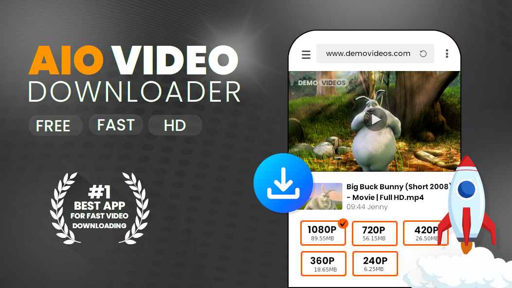
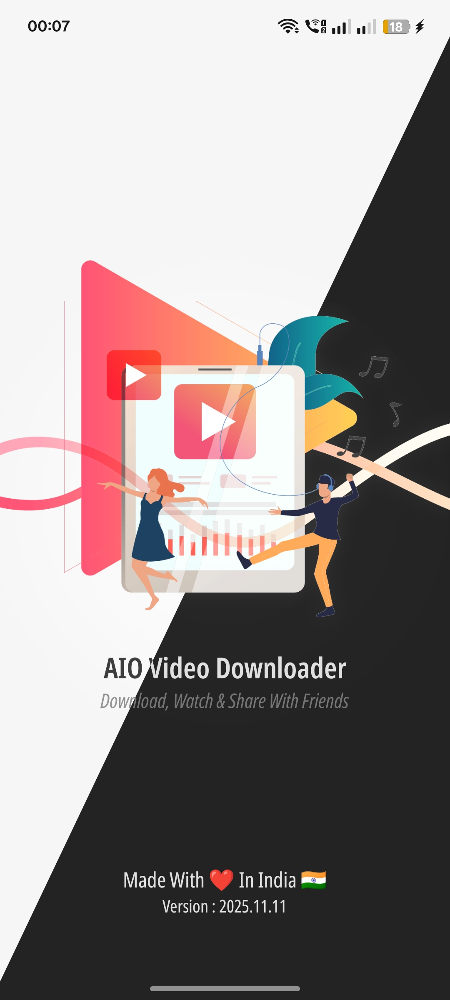
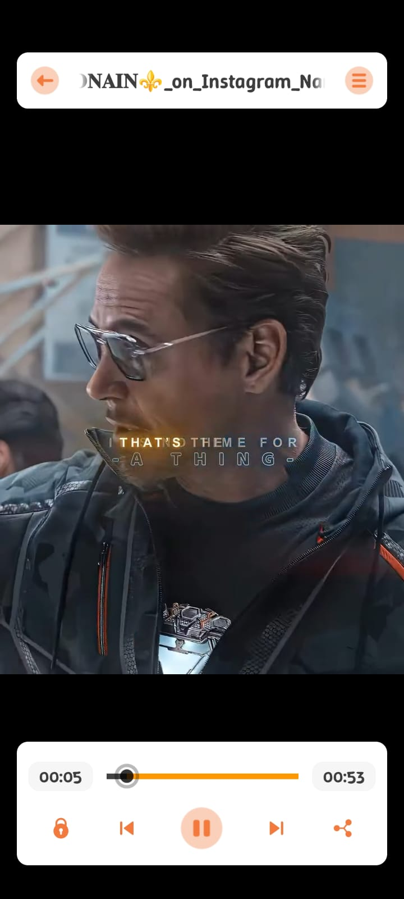
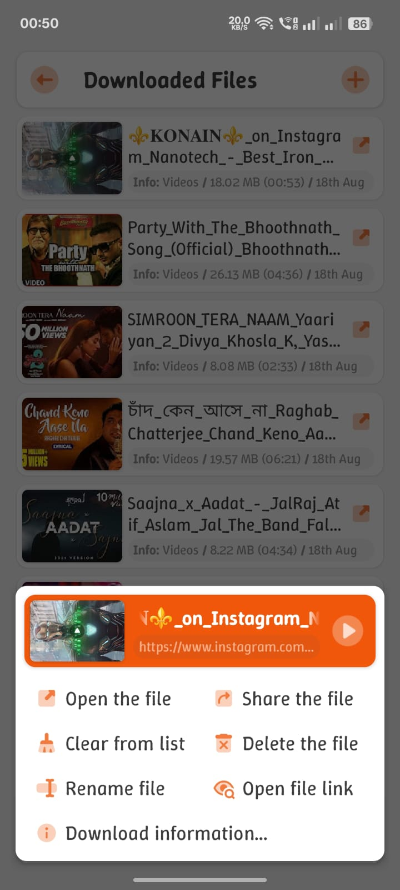

# AIO Video Downloader

### 🚀 All-in-One Video Solution: Download, Play, Protect - Simple, Fast & Private

----

  <a href="#-introduction">Introduction</a> •
  <a href="#-key-features">Features</a> •
  <a href="#-screenshots">Screenshots</a> •
  <a href="#-tech-stack--architecture">Architecture</a> •
  <a href="#-join-the-core-team">Contributing</a>

  
🌐 <b>Select Language (Read in your native language)</b>

  

    <a href="README.md">English</a> | 
    <a href="docs/README_ZH.md">简体中文</a> | 
    <a href="docs/README_HI.md">हिन्दी</a> | 
    <a href="docs/README_ES.md">Español</a> | 
    <a href="docs/README_FR.md">Français</a> | 
    <a href="docs/README_ID.md">Bahasa Indonesia</a> | 
    <a href="docs/README_RU.md">Русский</a> | 
    <a href="docs/README_VI.md">Tiếng Việt</a>
  

 

---

## 📌 Introduction

**AIO Video Downloader** is a high-performance media companion for Android. It combines a powerful downloading engine, a feature-rich video player, and a secure private vault into a single, seamless experience.

Built on the robust **[yt-dlp](https://github.com/yt-dlp/yt-dlp)** core, it supports over **1000+ websites** with optimized parallel connections for maximum speed.

---

## 🤝 Join the Core Team (Maintainers Wanted)

We are looking for **Project Maintainers** to help drive the technical future of AIO. If you are a developer looking for a modular, clean Kotlin project to contribute to, we'd love to have you.

### 🛠 How You Can Help:
* **Core Maintenance:** Optimize independent modules and engine performance.
* **Extraction Specialists:** Refine `yt-dlp` and `NewPipe Extractor` integration.
* **UI/UX Development:** Evolve our custom-themed, performance-first interface.
* **Code Quality:** review PRs and help maintain a stable main branch.

### 💻 Tech Stack & Architecture
* **Language:** 100% Kotlin
* **Architecture:** Modular MVVM with strict separation of concerns.
* **Core Design:** * **Independent Modules:** Core logic is decoupled from UI.
    * **Data Layer:** Robust metadata handling and file state management.
    * **Custom UI:** Performance-optimized custom themes (Non-Material strict).
* **Primary Engines:**
    * [ytdlp-android-wrapper](https://github.com/yausername/youtubedl-android)
    * [NewPipe Extractor](https://github.com/TeamNewPipe/NewPipeExtractor)

> **Interested?** Please open a [New Issue](https://github.com/shibaFoss/AIO-Video-Downloader/issues) with the tag `[Maintainer]` to discuss onboarding.

---

## ✨ Key Features

* 🎯 **Simple & Intuitive:** One-tap downloads and smart content detection.
* ⚡ **Supercharged Speed:** Multi-connection downloads and background processing.
* 🎬 **Powerful Player:** HW acceleration, subtitle support, and background playback.
* 🔒 **Private Vault:** Secure, app-locked storage for sensitive media.
* 🌐 **Universal Support:** Works with 1000+ sites via built-in secure browser.
* 🛡️ **Ad-Free & Open Source:** Transparent, safe, and privacy-respecting.

---

## 📱 Screenshots

  
  
  
   
  
  
  

---

## 🚀 Getting Started

1.  **Paste URL:** Copy any video link or browse using the in-app browser.
2.  **Auto-Detect:** The app will automatically find high-quality streams.
3.  **Choose & Download:** Select your resolution (up to 4K) and download.
4.  **Secure:** Move downloads to the **Private Folder** to hide them from the gallery.

---

## 🔧 Technical Specifications

* **Platform:** Android 8.0+ (API 26)
* **Engine:** yt-dlp / youtubedl-android
* **Language:** Kotlin
* **License:** Custom Open Source License

---

  <b>Made with ❤️ in India 🇮🇳</b>
   
  <i>Respecting Privacy • Promoting Transparency</i>

