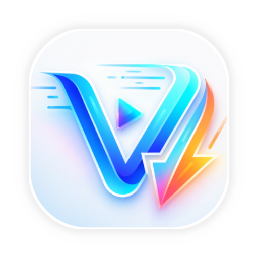

<div align="center">



# TubeAIO NextGen

### *The Next Generation of All-in-One Video — Rewritten from the Ground Up*

[](https://github.com/shibaFoss/AIO-Video-Downloader)
[](https://tubeaio.com)
[](https://tubeaio.com)
[](https://github.com/shibafoss/AIO-Video-Downloader/releases/)
[](https://github.com/shibaFoss/AIO-Video-Downloader/stargazers)
[](https://instagram.com/shibafoss)
<br/>
<br/>
[](https://tubeaio.com/)
<br/>
[🌐 Website](https://tubeaio.com) • [🐛 Report Bug](https://github.com/shibaFoss/AIO-Video-Downloader/issues) • [💬 Discussions](https://github.com/shibaFoss/AIO-Video-Downloader/discussions) • [📖 Documentation](docs)


</div>

## 📌 About the Project

Welcome to **TubeAIO NextGen** — a ground-up reimagining of the
beloved [AIO Video Downloader](https://github.com/shibaFoss/AIO-Video-Downloader), one of the most
popular open-source video downloader on GitHub with thousands of downloads and a thriving
community.

### Why a rewrite?

The original AIO Video Downloader was an incredible piece of software. Built on the rock-solid *
*[yt-dlp](https://github.com/yt-dlp/yt-dlp)** engine, it delivered a smooth, privacy-respecting
experience that people genuinely loved. But as the feature requests grew — a recommendation engine,
torrent support, a full-featured browser, advanced background playback, a movie section — it became
clear that bolting these onto the existing architecture would eventually compromise performance,
stability, and developer happiness.

So we made a bold decision: **start fresh.**

TubeAIO NextGen is a complete rebuild. Every module, every decision, every line of code has been
reconsidered from the ground up — not because the old way was wrong, but because the future we want
to build demands a stronger foundation. The spirit of AIO remains unchanged: open, private, ad-free,
and community-driven. But now it's built to scale, evolve, and surprise you.

> 🔗 **Coming from the original AIO?** This project is a fresh branch of the original AIO Video
> Downloader. For the current stable release, visit
> the [legacy AIO repo](https://github.com/shibaFoss/AIO-Video-Downloader). TubeAIO NextGen is a
> sibling project with an expanded vision and a fully redesigned architecture.

## 🎯 Our Vision — What We're Building

This isn't just an update. It's a statement of intent. Here's what the NextGen platform is set to
deliver:

| Feature                            | Description                                                                                                                          |
|:-----------------------------------|:-------------------------------------------------------------------------------------------------------------------------------------|
| 🤖 **Smart Recommendation Engine** | Personalized video recommendations based on your watch history, searches, and interactions. Think of it as your own private curator. |
| 🎵 **Robust Background Audio**     | Keep the music and podcasts playing while you use other apps or lock your screen. No interruptions — just pure audio.                |
| 🌐 **Built-in Ad-Free Browser**    | Browse the web completely ad-free with a built-in video grabber that's always watching. Find a video anywhere, grab it instantly.    |
| 🎬 **Movie Download Section**      | A dedicated section to search movie repositories, stream or download films — all from within the app.                                |
| ⚡ **Torrent Support**              | Download files and media directly via torrent, without needing a separate app or tool.                                               |
| 🔒 **Private Vault**               | Secure, app-locked storage for your sensitive media — hidden from the gallery and protected.                                         |
| 🎬 **Powerful Video Player**       | Hardware-accelerated playback, subtitle support, up to 4K quality, and casting support.                                              |
| 🌍 **Universal Platform Support**  | Works with 1000+ websites via yt-dlp, plus the built-in browser for everything else.                                                 |
| 🛡️ **100% Ad-Free & Open Source** | No ads, no trackers, no telemetry. Just you, your content, and your privacy.                                                         |

And of course — **everything the original AIO had, and more.** We're not leaving any feature behind.

## ✨ Key Features

|                                                      |                                                                  |                                                       |
|:-----------------------------------------------------|:-----------------------------------------------------------------|:------------------------------------------------------|
| 🎯 **One-Tap Simplicity**                            | ⚡ **Multi-Connection Speed**                                     | 🎬 **4K Video Playback**                              |
| Smart content detection makes downloading effortless | Parallel connections and background processing for maximum speed | Hardware acceleration, subtitles, and casting support |
| 🔒 **Private Vault**                                 | 🌐 **Universal Support**                                         | 🛡️ **Ad-Free Forever**                               |
| Secure, app-locked storage for sensitive files       | Works with 1000+ sites and a built-in browser                    | No ads, no trackers, no nonsense                      |

## 📱 Screenshots

> 📸 **Screenshots below are from the original AIO Video Downloader (legacy). The TubeAIO NextGen UI
is being built from scratch with a fresh, modern design. Fresh screenshots coming soon!**


## 💻 Tech Stack & Architecture

TubeAIO NextGen is built with modern Android development best practices in mind. The architecture is
designed for **scalability**, **maintainability**, and **performance** — allowing contributors to
work on independent modules without stepping on each other's toes.

### 🏗️ Architecture Overview

```
┌─────────────────────────────────────────────┐
│                 UI Layer                    │
│  (Kotlin, Custom Views, MVVM, Coroutines)   │
├─────────────────────────────────────────────┤
│              Domain Layer                   │
│  (Use Cases, Business Logic, Interfaces)    │
├─────────────────────────────────────────────┤
│               Data Layer                    │
│  (Repositories, Data Sources, Caching)      │
├─────────────────────────────────────────────┤
│             Engine Layer                    │
│   (yt-dlp, NewPipe, Torrent, Browser)       │
└─────────────────────────────────────────────┘
```

### 🛠️ Technology Stack

- **Language:** 100% Kotlin
- **Architecture:** Modular MVVM with Clean Architecture principles
- **UI:** Custom performance-optimized themes (non-Material strict)
- **Async:** Kotlin Coroutines + Flow for reactive data streams
- **DI:** Dependency Injection for loose coupling
- **Engines:**
    - [yt-dlp](https://github.com/yt-dlp/yt-dlp) — the heart of video extraction
    - [youtubedl-android](https://github.com/yausername/youtubedl-android) — Android wrapper for
      yt-dlp
    - [NewPipe Extractor](https://github.com/TeamNewPipe/NewPipeExtractor) — alternative extraction
      backend

## 🚀 Getting Started

Ready to dive in? Here's how to get started with TubeAIO NextGen:

### 🔽 Installation

1. Download the latest APK from [tubeaio.com](https://tubeaio.com) or from
   the [Releases page](https://github.com/shibaFoss/AIO-Video-Downloader/releases).
2. Install the APK on your Android 8.0+ device.
3. Grant the necessary permissions (storage, network) and you're good to go.

### 🎬 Using the App

1. **Browse** — Use the built-in ad-free browser to find any video, or search directly in the Movie
   section.
2. **Detect** — The app automatically detects media streams, torrent links, and downloadable
   content.
3. **Choose** — Pick your quality (up to 4K), subtitle language, or torrent settings.
4. **Download** — Watch the progress, manage queues, and continue browsing.
5. **Watch** — Play downloaded content with the powerful built-in player or cast to your TV.
6. **Secure** — Move sensitive files to the **Private Folder** to hide them from the gallery.

## 🤝 Join the Team

We're building something ambitious, and we need helping hands! **TubeAIO NextGen is looking for
maintainers, contributors, and open-source enthusiasts** who want to be part of a community-driven
project that respects user privacy.

### 🧑‍💻 Open Roles

| Role                           | What You'll Do                                                                             |
|:-------------------------------|:-------------------------------------------------------------------------------------------|
| 🏗️ **Core Developer**         | Build and optimize the download engine, torrent module, and background playback system.    |
| 🤖 **Recommendation Engineer** | Design and implement the smart recommendation system — algorithms, data pipelines, and UI. |
| 🌐 **Browser Developer**       | Build the ad-free web browser with seamless video detection and smooth UX.                 |
| 🎬 **Media Section Developer** | Implement the movie search, repository integration, and streaming playback.                |
| 🎨 **UI/UX Designer**          | Craft the NextGen interface — clean, modern, and performance-first.                        |
| 🔍 **Code Reviewer**           | Help maintain code quality, review PRs, and keep the main branch stable.                   |

### 💡 How to Contribute

1. **Fork** the repository and explore the codebase.
2. Pick an issue tagged with `[NextGen]` or propose a new feature.
3. Make your changes, write tests if applicable, and submit a pull request.
4. Join the discussion and help shape the future of the project.

> 💬 **Want to get involved?** Open
> a [New Issue](https://github.com/shibaFoss/AIO-Video-Downloader/issues) with the tag
`[NextGen Contributor]` and tell us how you'd like to help. We also have
> a [Discussions page](https://github.com/shibaFoss/AIO-Video-Downloader/discussions) where we talk
> about features, architecture, and the roadmap.

## 🔧 Technical Specifications

| Specification          | Details                            |
|:-----------------------|:-----------------------------------|
| **Minimum Android**    | Android 8.0 (API 26)               |
| **Language**           | 100% Kotlin                        |
| **Architecture**       | Modular MVVM + Clean Architecture  |
| **Extraction Engine**  | yt-dlp / youtubedl-android         |
| **Alternative Engine** | NewPipe Extractor                  |
| **License**            | Custom Open Source License         |
| **Website**            | [tubeaio.com](https://tubeaio.com) |

## 📜 Multi-Language Support

We're committed to making TubeAIO NextGen accessible to everyone. The README is available in
multiple languages:

English | [简体中文](docs/README_ZH.md) | [हिन्दी](docs/README_HI.md) | [Español](docs/README_ES.md) | [Français](docs/README_FR.md) | [Bahasa Indonesia](docs/README_ID.md) | [Русский](docs/README_RU.md) | [Tiếng Việt](docs/README_VI.md)

### 🌟 If You Like What We're Building — Give Us a Star!

It takes a second, and it really helps more people discover the project. Every ⭐ means the world to
us.

[](https://github.com/shibaFoss/AIO-Video-Downloader/stargazers)

**Made with ❤️ in India 🇮🇳**

*Respecting Privacy • Promoting Transparency • Building the Future*